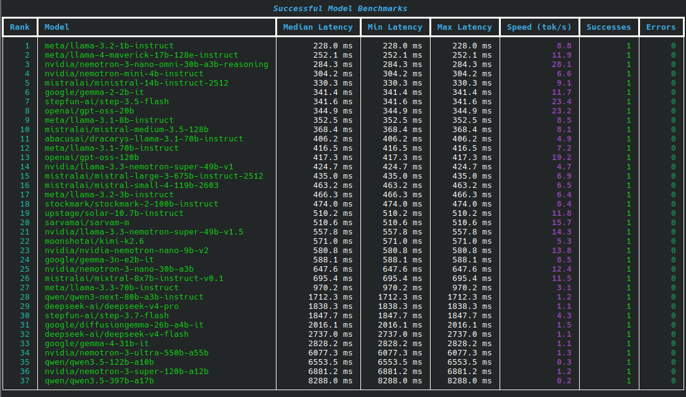

<p align="center">
  
</p>

<p align="center">
  <b>A lightweight, high-performance benchmarking tool for NVIDIA NIM LLMs.</b><br>
  <i>Measure latency, throughput, and reliability with style.</i>
</p>

---

## 🚀 Overview

`nimbench` is a surgical CLI tool designed to benchmark NVIDIA NIM (NVIDIA Inference Microservices) chat models. Powered by `httpx` for connection-pooled requests and `rich` for beautiful terminal presentation, it handles model discovery, intelligent filtering, and robust benchmarking, providing you with a clean, formatted performance report.

## ✨ Key Features

- **🔍 Auto-Discovery**: Automatically finds and ranks all available models from your NVIDIA NIM endpoint.
- **📊 Precise Metrics**: Measures Median, Min, Max latency and Tokens Per Second (TPS).
- **⏱️ Progress & ETA**: Live interactive progress bar with percentage and estimated time remaining.
- **🌈 Rich Terminal UI**: Beautiful, color-coded status tables and highlights using `rich`.
- **🔌 Connection Pooling**: Uses `httpx` to reuse TCP connections, minimizing handshake overhead for accurate latency comparisons.
- **🛡️ Intelligent Retries**: Automatically handles rate limits (429) by respecting `Retry-After` headers and applies temperature fallbacks when needed.
- **📝 Failure Analysis**: Detailed breakdown of failure reasons (Not Provisioned, Timeout, Unsupported, etc.).
- **💾 Skip Cache**: Remembers failed models to speed up subsequent runs.

---

## 🔬 What it measures

`nimbench` measures wall-clock request time for a minimal `POST /v1/chat/completions` call. It is designed to evaluate **request/response latency** rather than long-form output quality.

**Default Request Shape:**
- **Prompt:** `Reply with one short word.`
- **Max Tokens:** `8`
- **Temperature:** `0.0` (with automatic fallback to `0.1` if rejected).

The CLI reports tokens per second for each model. It uses server-provided metrics when available, or derives an approximate rate from `completion_tokens / wall_time`.

---

## 🛠️ How it behaves

- **Discovery**: Fetches all models from `GET /v1/models` and filters for likely chat-capable IDs.
- **Sequential Execution**: Benchmarking is performed sequentially to preserve the **40 RPM** (Requests Per Minute) cap.
- **Intelligent Skipping**: A local skip cache is maintained for models that are not provisioned, reject chat input, or repeatedly timeout.
- **Cap Logic**: The `--limit` flag means "stop after N **successful** benchmarks", preventing your rate limit from being wasted on unavailable models.

---

## 📦 Installation

Requires Python 3.10+.

```bash
git clone https://github.com/your-username/nimbench.git
cd nimbench
pip install -e .
```

## 🚀 Quick Start

Benchmark the top 10 most likely chat models:
```bash
python3 -m nimbench --limit 10
```

### Advanced Usage
```bash
# Benchmark everything (including non-chat) with 3 repeats each
python3 -m nimbench --all-models --repeats 3

# Filter for specific models using regex
python3 -m nimbench --pattern "llama|nemotron|mistral"

# Export results to JSON
python3 -m nimbench --limit 5 --json > results.json
```

---

## ⚙️ Configuration & Options

### API Key Precedence
1. `--api-key` command-line argument.
2. `NVIDIA_API_KEY` environment variable.
3. Interactive prompt.

### Options
| Option | Description |
| :--- | :--- |
| `--api-key KEY` | NVIDIA API key |
| `--base-url URL` | API base URL (Default: `https://integrate.api.nvidia.com/v1`) |
| `--limit N` | Stop after N successful benchmarks |
| `--pattern REGEX` | Only consider model ids matching REGEX |
| `--timeout SECONDS` | Request timeout for each HTTP call |
| `--repeats N` | Requests per model |
| `--json` | Emit JSON instead of a text table |
| `--rpm N` | Request rate cap (Default: 40) |
| `--all-models` | Benchmark full catalog instead of chat-only default |
| `--refresh-cache` | Ignore the local skip cache for this run |

### Environment Variables
- `NVIDIA_API_KEY`: Your NVIDIA API key.
- `NIMBENCH_CACHE_DIR`: Set this to override the default local skip cache directory.

---

## 🧪 Testing

Run the comprehensive test suite:
```bash
python3 -m unittest discover tests
```

---

<p align="center">
  Built with 💚 for the LLM community.
</p>
